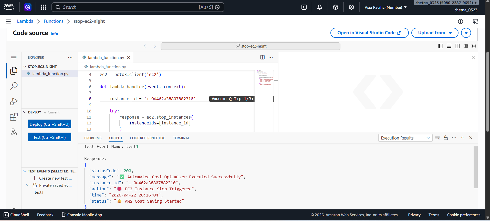
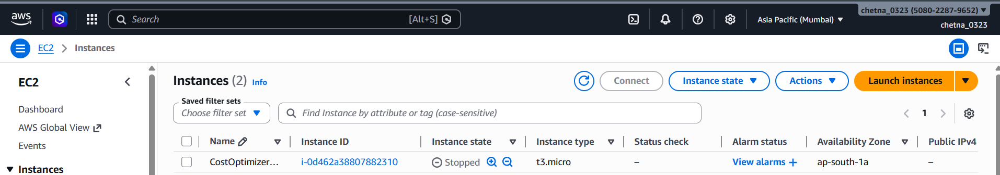
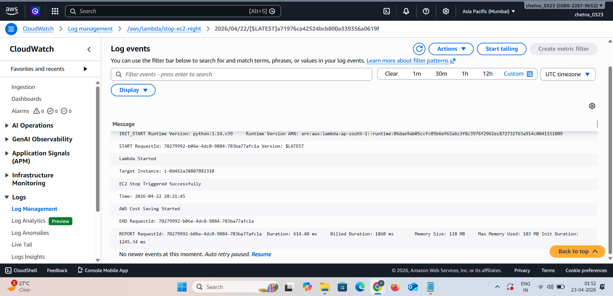

🚀 Automated Cost Optimizer using AWS Lambda & CloudWatch


---

📌 Project Overview

This project demonstrates how to automatically reduce AWS costs by stopping unused EC2 instances using AWS Lambda and CloudWatch.

A serverless Lambda function is triggered via CloudWatch to stop EC2 instances, preventing unnecessary billing and improving cloud efficiency.

---

🎯 Purpose

- Reduce AWS bills automatically 💰  
- Avoid idle EC2 usage  
- Automate infrastructure management  
- Implement serverless cost optimization  

---

🧰 AWS Services Used

- AWS Lambda  
- Amazon EC2  
- Amazon CloudWatch  
- IAM (Roles & Permissions)  

---

🏗️ Architecture Diagram


---

🔄 Architecture Flow

User/Admin → CloudWatch Event → Lambda Function → EC2 Instance → CloudWatch Logs  

---

⚡ AWS Lambda Function



The Lambda function:
- Uses Python (boto3)  
- Connects to EC2  
- Stops the instance automatically  
- Returns execution response  

---

🖥️ EC2 Instance Status



The EC2 instance is successfully:
- Running → Stopped  
- Confirms cost optimization  

---

📊 CloudWatch Logs



CloudWatch logs show:
- Lambda execution start  
- EC2 stop trigger  
- Successful completion  

---

🧠 How It Works

1. User configures CloudWatch trigger  
2. CloudWatch invokes Lambda function  
3. Lambda executes Python script  
4. boto3 connects to EC2  
5. EC2 instance is stopped  
6. Logs stored in CloudWatch  

---

💻 Lambda Code

```python
import boto3

ec2 = boto3.client('ec2')

def lambda_handler(event, context):

    instance_id = 'your-instance-id'

    try:
        response = ec2.stop_instances(
            InstanceIds=[instance_id]
        )

        return {
            "statusCode": 200,
            "message": "EC2 Instance Stopped Successfully"
        }

    except Exception as e:
        return {
            "statusCode": 500,
            "error": str(e)
        }
```

---

📁 Project Structure

```
Automated-Cost-Optimizer/
│── lambda_function.py
│── README.md
│── screenshots/
│    ├── architecture.jpg
│    ├── lambda.png
│    ├── ec2.png
│    ├── cloudwatch.png
```

---

📸 Screenshots Description

- Architecture Diagram  
  Shows flow: CloudWatch → Lambda → EC2 → Logs  

- Lambda Screenshot  
  Displays function code and successful execution  

- EC2 Screenshot  
  Shows instance status changed to Stopped  

- CloudWatch Logs Screenshot  
  Displays execution logs  

---

🔥 Key Features

- Fully automated EC2 shutdown  
- Serverless architecture  
- Cost-efficient solution  
- Easy scheduling with CloudWatch  
- Real-time logging  

---

💡 Use Case

Automatically stop EC2 instances during:
- Night hours 🌙  
- Weekends 📅  
- Non-working hours  

---

✅ Conclusion

This project demonstrates how AWS Lambda and CloudWatch can be used to build an automated cost-saving system.

It helps in:
- Reducing cloud expenses 💰  
- Automating operations ⚙️  
- Improving efficiency 🚀  
